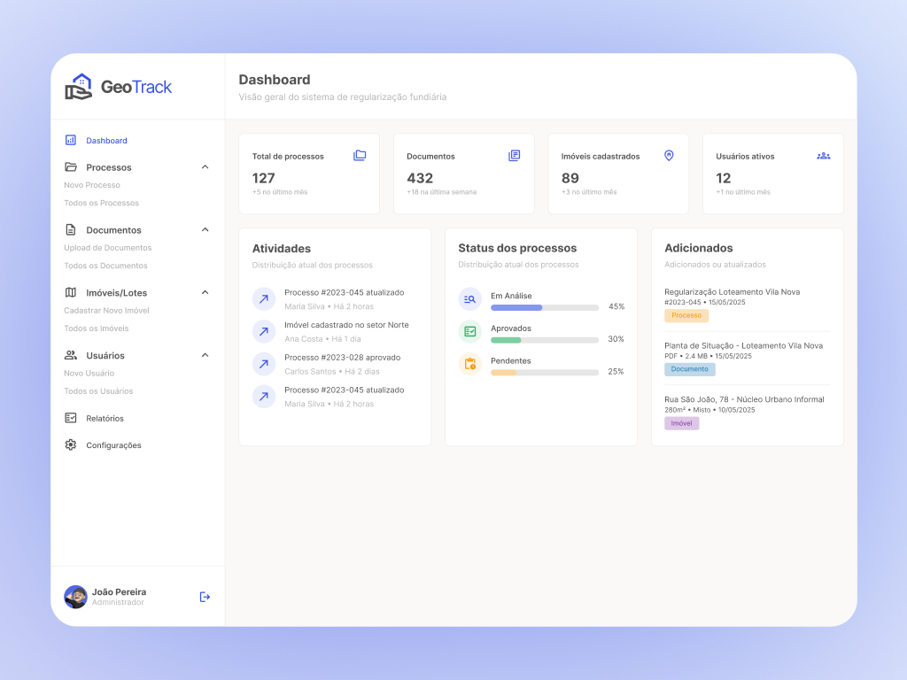

## Visão geral

GeoTrack organiza um trabalho que costuma viver espalhado entre papel, planilha
e gaveta: a regularização fundiária. Centraliza processos, documentos, imóveis e
pessoas em um sistema só, e mostra, a qualquer momento, em que pé está cada
caso. Atuei como product designer, dos fluxos ao design system.

## O desafio

Regularização fundiária é um domínio difícil de propósito: muita regra, muitos
documentos por processo (plantas, certidões, PDFs) e nenhuma margem para perder
o rastro de um caso. O desafio era domar a densidade: reduzir erro nas tarefas
que se repetem, acelerar o operacional e manter a rastreabilidade de ponta a
ponta, sem esconder informação de quem depende dela.

## Processo

Comecei mapeando os fluxos com quem opera o sistema, não com quem o compra. A
partir daí, desenhei os padrões que sustentam produto enterprise: tabelas que
aguentam centenas de linhas sem cansar, formulários longos quebrados em etapas,
uma navegação lateral que espelha o próprio domínio (processos, documentos,
imóveis e lotes, usuários, relatórios) e um design system para tudo isso crescer
sem se contradizer.

## Resultado

O dashboard dá conta da complexidade sem repassá-la para o usuário. No topo, os
números que importam (processos, documentos, imóveis, usuários ativos). No meio,
a distribuição por status (em análise, aprovado, pendente) em uma olhada. Ao
lado, o histórico de atividade, para ninguém precisar perguntar "o que mudou
desde ontem?". É um painel que responde antes de a pergunta ser feita.
