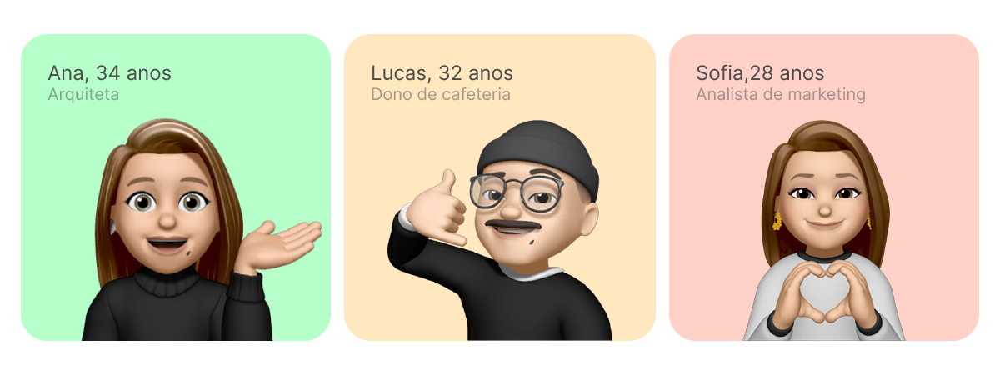
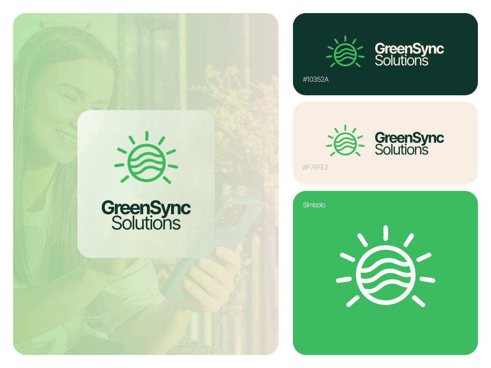
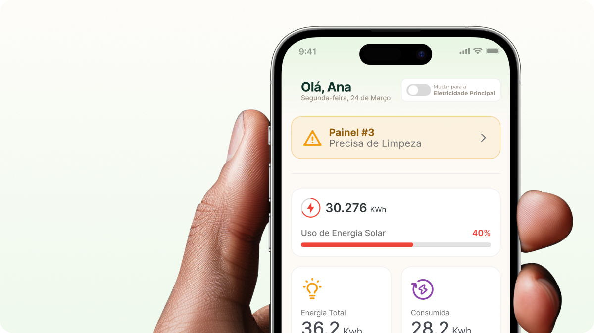

## Visão geral

GreenSync Solutions começou por uma pergunta que quase ninguém com painel
solar responde de cabeça: "vale a pena, e o que eu faço com isso?". O app
acompanha geração e consumo em tempo real e devolve não um relatório, mas uma
resposta. Quanto você gerou hoje, quanto economizou e qual painel precisa de
atenção.

Cuidei da pesquisa, da identidade da marca e do desenho da interface, do
primeiro fluxo ao detalhe de cada painel.

## O desafio

Energia solar gera dado em excesso: potência instantânea, acumulado do dia,
consumo, economia, histórico, estado de cada equipamento. Jogar tudo isso na
tela afasta justamente quem instalou painel para não pensar em energia o dia
inteiro.

O problema de design não era mostrar números. Era decidir o que aparece
primeiro, o que fica a um toque de distância e o que vira alerta. E a mesma
tela precisava servir três pessoas muito diferentes sem virar três apps.

## Pesquisa

Parti de três personas com rotinas e níveis técnicos distintos. Não eram
enfeite: cada uma puxava a interface para um lado.

Ana quer clareza e uma tela bonita que não canse de abrir. Lucas, dono de
cafeteria, só quer saber se a conta fechou no fim do mês. Sofia vive de dado e
quer descer ao detalhe, hora a hora. A tensão entre os três virou a regra do
produto: a tela lidera com a resposta (o gerado no dia e a economia) e guarda a
profundidade para quem for atrás dela. Cada perfil encontra o seu nível sem
precisar atravessar a informação do outro.

## Identidade visual

A marca precisava soar limpa sem soar genérica. O símbolo une dois gestos: o
sol, que é a geração, sobre ondas, que são o fluxo da energia, num traço
contínuo. O verde é vivo o bastante para parecer otimista e estável o bastante
para passar confiança, com uma conta de luz em jogo.

O sistema foi pensado para viver fora da tela também: do ícone do app à
fachada e ao material institucional, mantendo o mesmo símbolo legível em
qualquer tamanho.

## Interface

A home abre chamando pelo nome e responde à pergunta principal antes de
qualquer outra: a energia gerada no dia, em destaque, e quanto disso veio do
sol. Logo abaixo, energia total e consumo lado a lado, para a leitura ser
comparação e não conta de cabeça.

A camada que amarra tudo é o estado de cada painel. Quando a geração de um
deles cai, o app não esconde o dado num gráfico: levanta um aviso direto
("Painel #3 precisa de limpeza") e transforma monitoramento em manutenção. A
visão de economia separa eletricidade e energia total em abas, para o Lucas ver
a conta e a Sofia ver a curva na mesma tela.

## Resultado

A leitura cabe em segundos: você abre, entende como o dia está indo e sabe se
precisa agir. A hierarquia desce do panorama ao painel e ao toque, o alerta
puxa a ação sem exigir que ninguém vá procurar, e o onboarding encurta a curva
entre abrir o app pela primeira vez e confiar no que ele mostra.

No fim, GreenSync faz uma coisa só e faz bem: torna visível a energia que já
estava ali, no telhado.
