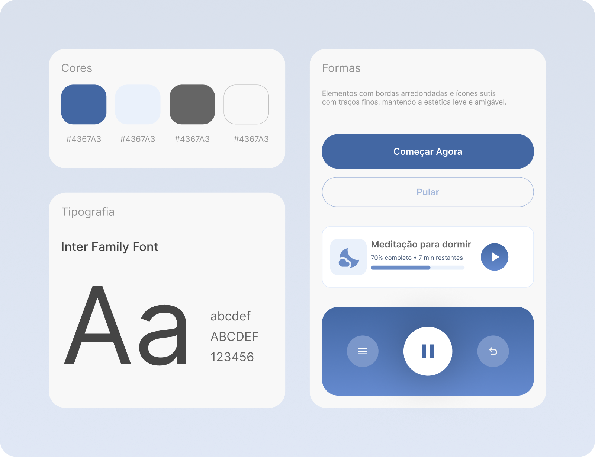
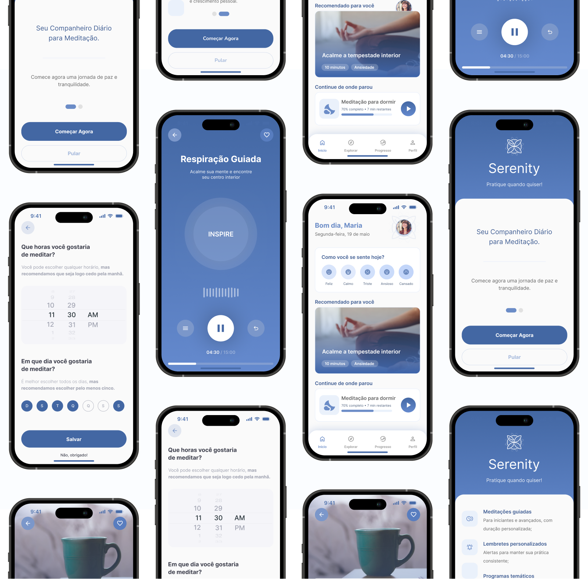

## Visão geral

Serenity é um app de meditação e mindfulness com uma meta clara: acalmar desde a
primeira tela. Cuidei da UI e do design system, da saudação ("Bom dia") até o
player de respiração guiada.

## O desafio

Quem abre um app de meditação está, muitas vezes, ansioso ou cansado. Cada toque
a mais, cada tela barulhenta, empurra a pessoa para longe do play. O desafio foi
desenhar uma interface que respira: hierarquia suave, pouco texto e o menor
caminho possível entre a intenção de meditar e o início da sessão.

## Design system

Uma base enxuta sustenta a calma. Paleta em azuis dessaturados, tipografia Inter
pela leitura tranquila, formas arredondadas e ícones de traço fino.

Cada onboarding traz uma ação clara (Começar agora) e uma saída clara (Pular),
para ninguém se sentir preso. É um sistema pensado para sumir: quanto menos a
interface aparece, melhor ela cumpre o papel aqui.

## Interface

O app abre perguntando como você se sente e usa a resposta para sugerir a sessão
certa, seja acalmar a ansiedade ou preparar o sono. Retoma de onde você parou,
sem fazer procurar.

No centro de tudo está a respiração guiada: uma tela única, escura, com o
"inspire" pulsando no ritmo certo, onde só existem você e o próximo ciclo. Da
agenda ("que horas você gostaria de meditar?") ao Apple Watch, cada tela mantém
o mesmo compasso: pouco texto, foco no conteúdo, navegação que sai do caminho.

## Resultado

Uma experiência serena e coesa, em que o design system garante que a calma da
primeira tela continue igual na centésima. O maior elogio que uma interface
dessas pode receber é não ser notada, e Serenity foi desenhado exatamente para
isso.
