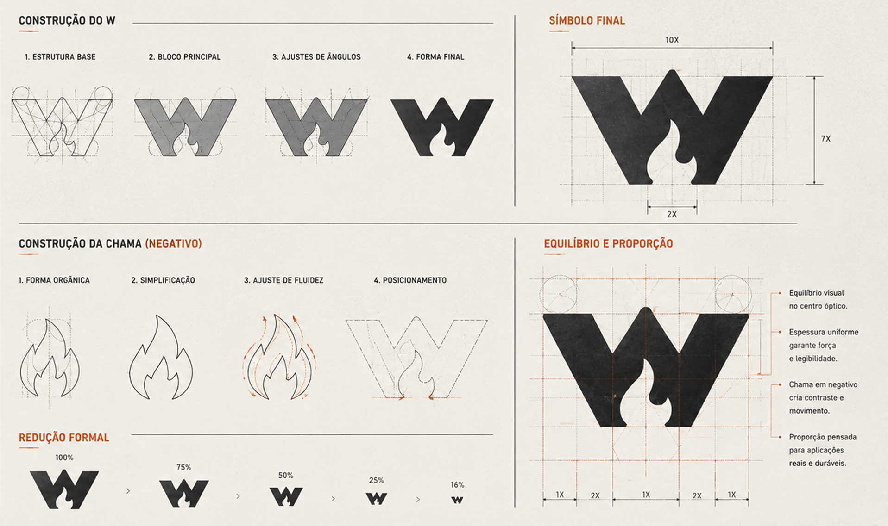
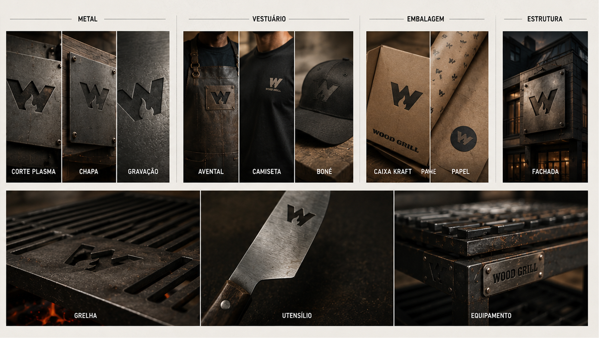
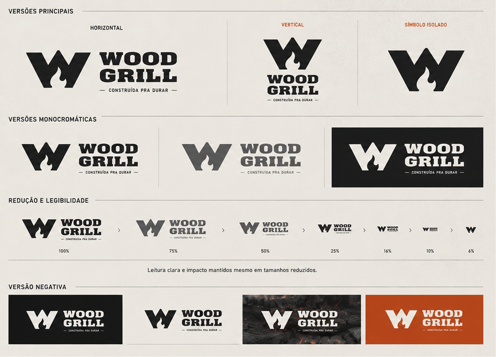

## Engenharia do fogo

Esse foi o conceito que guiou tudo. A Wood Grill precisava de uma marca tão
sólida quanto o que ela representa: estrutura, calor e durabilidade. Nada
decorativo, nada que envelhecesse em um ano. Assinei o símbolo, o sistema e as
aplicações, do desenho do W até a peça gravada no metal. A assinatura resume a
intenção: construída pra durar.

## O símbolo

O símbolo nasce de duas formas que se encaixam. O W dá a estrutura: peso,
ângulos firmes, estabilidade. A chama, recortada em negativo no vão do W, traz
o calor e o movimento sem precisar de uma única cor para "pegar fogo".

Construí cada parte por etapas (estrutura, bloco, ajuste de ângulos, fluidez da
chama) e travei a proporção numa malha, com espessura uniforme. Foi o que
permitiu a marca aguentar reduções extremas: a 6% do tamanho, o W ainda se lê e
a chama ainda aparece.

## Feita para o mundo real

Uma marca de grill não vive só na tela. Vive no metal quente, no avental, na
caixa de entrega e na fachada. Por isso desenhei o símbolo pensando em corte a
plasma, gravação em chapa e relevo, não só em pixel.

O ponto alto é a própria grelha: o W vazado nas barras de ferro, que marca a
peça e marca a carne. Quando a identidade encosta no produto desse jeito, ela
para de ser logo e vira parte da coisa.

## Uma identidade flexível

O sistema entrega o que uma operação real exige: versão horizontal, vertical e
símbolo isolado, mais as monocromáticas e a negativa para fundo escuro ou
queimado.

Tudo construído sobre a mesma malha, então a força e a legibilidade se mantêm do
letreiro da fachada ao bordado do boné.

## Resultado

Uma identidade que não depende de cor, textura ou tamanho para funcionar. Tira
o fogo, tira a cor, reduz a 6%, grava no ferro: continua sendo a Wood Grill.
Foi construída, como diz a própria assinatura, pra durar.
